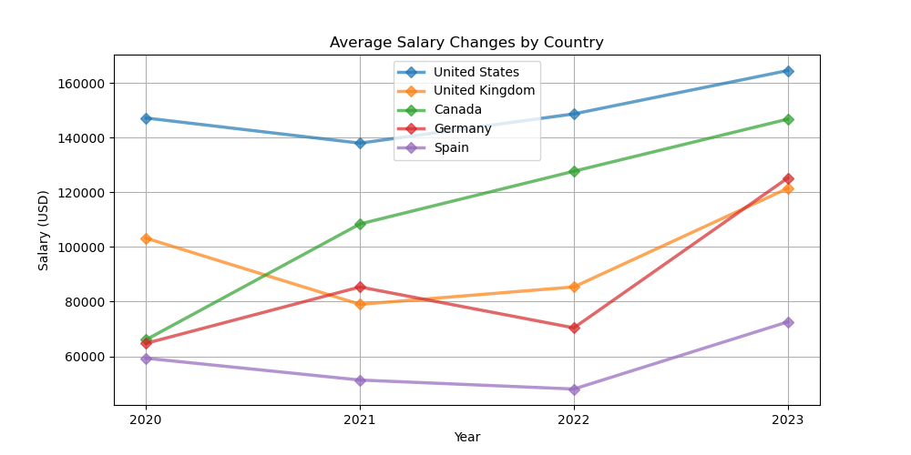
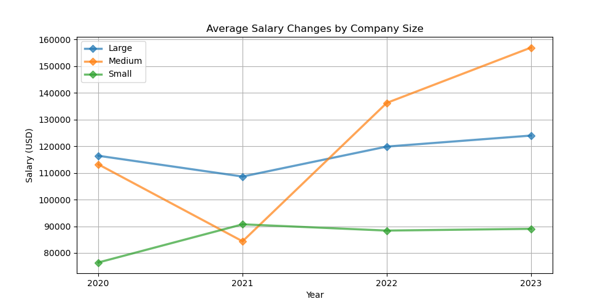
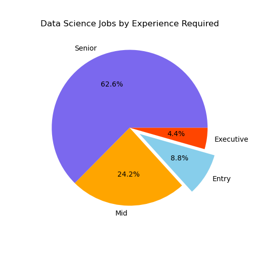
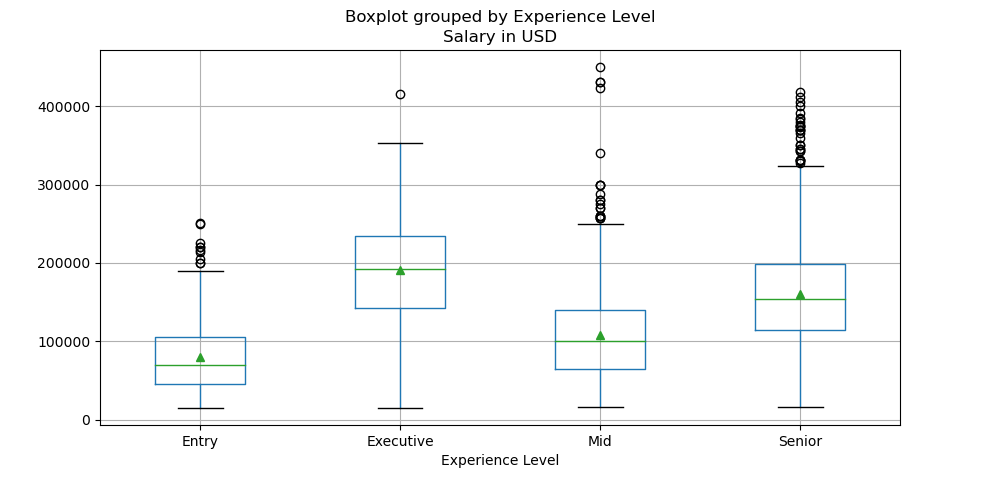
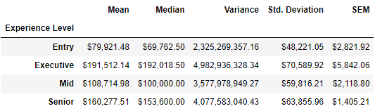
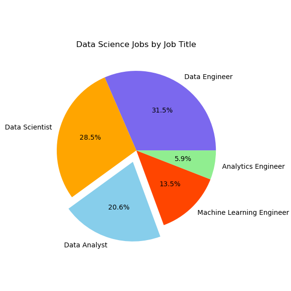
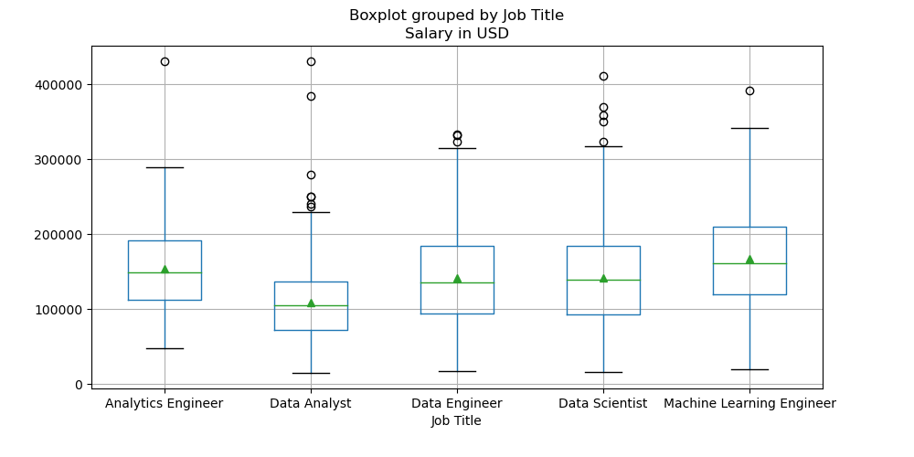
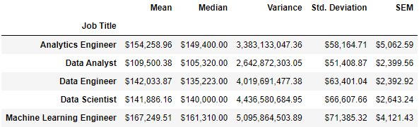
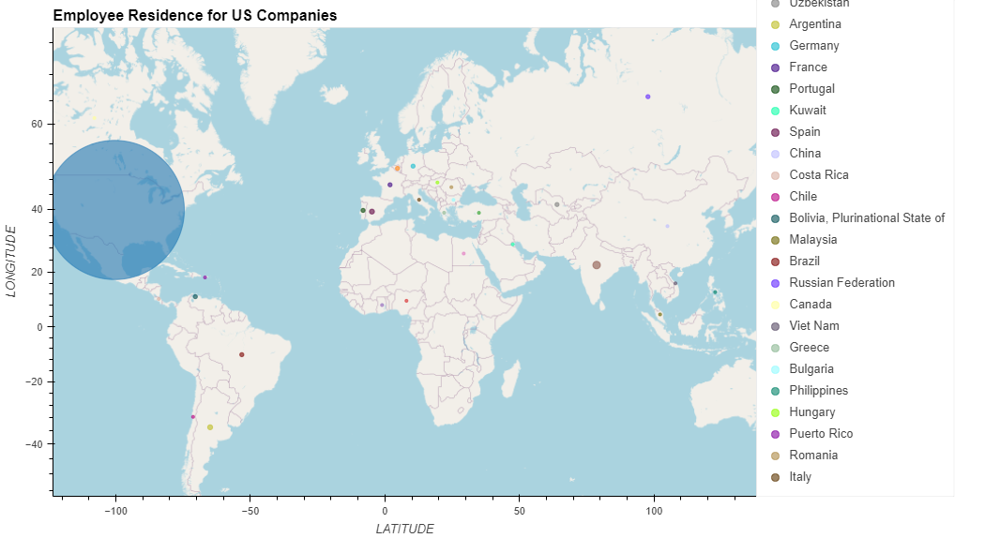
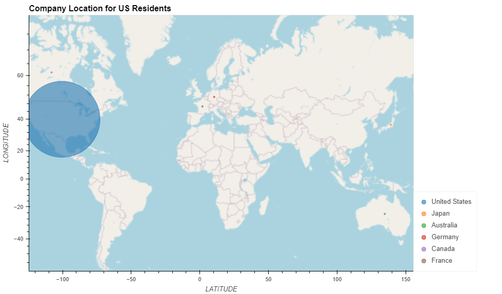

# project-01
## Project 1

________________________________________________________________________

### PROJECT TITLE : 

"Data Science Salaries - Managing Expectations"

________________________________________________________________________
   
### TEAM MEMBERS:

* Leah Latham
* Jonah Foeday
* Manroop Gill
* Murtatha Alwan

________________________________________________________________________

### PROJECT DESCRIPTION/OUTLINE:  

* Jupyter Notebook
1. Import, read, and display CSV file
2. Identify top-5 countries by volume and calculate average salary for each country by year
3. Identify company sizes and calculate average salary for each size by year
4. Create line graphs for task #2 and #3
5. Create summary statistics for job title and experience level
6. Create boxplots for job title and experience level
7. Create pie chart by job title and experience level
8. Identify latitude and longitude using geoapify API for country lists
9. Create geomaps for US companies and US residents
10. Save images to file

* Presentation
1. Assemble graphs/maps from ipynb file
2. Summarize findings

________________________________________________________________________

### RESEARCH QUESTIONS TO ANSWER:

1. How have data science salaries changed over time?  (by country and company size)
2. What is the breakdown of experience level required for data science jobs, and how do they vary?
3. What is the breakdown of job titles for data science jobs, and how do they vary?
4. Do US companies hire US residents, and do US residents work for US companies?

________________________________________________________________________

### DATASET(s)/API(s) TO BE USED:

Data Science Salaries: 2020-2023 https://www.kaggle.com/datasets/iamsouravbanerjee/data-science-salaries-2023

Geocoder API: (https://apidocs.geoapify.com/docs/geocoding/forward-geocoding/#api)

________________________________________________________________________

### ROUGH BREAKDOWN OF TASKS:

* Leah Latham - geomaps and summary
* Jonah Foeday - pie graph, boxplot, and summary statistics
* Manroop Gill - pie graph, boxplot, and summary statistics
* Murtatha Alwan - Intro and line graphs
* Combined - Write-up and PPT

_________________________________________________________________________

## REFERENCES / RESOURCES

* hvPlot customization : https://hvplot.holoviz.org/user_guide/Customization.html
* class activities / slides

_________________________________________________________________________

## INCLUDED IN THIS REPOSITORY

This repository contains the following:
* "Resources" folder containing the original CSV file
* "Images" folder containing png images of the graphs, maps, and summary statistics analyzed for this project
* data_science.ipynb - Jupyter Notebook containing analysis
* project_01_presentation.pptx - PowerPoint presentation containing overview of findings
* project_01_presentation.pdf - PDF version of the PowerPoint presentation

_________________________________________________________________________

## ANALYSIS

### 1. How have data science salaries changed over time?  (by country and company size)

- Data science salaries have increased over time with medium size companies showing the highest growth and US companies consistently offering the highest average salary
- 89.8% of the company locations in the dataset were the top 5 countries (US, UK, Canada, Germany, and Spain), with 75.6% of overall company locations housed in the US
- In addition to showing the most growth, medium-sized companies were also the most common with 2707 out of 3300 jobs

### 2. What is the breakdown of experience level required for data science jobs, and how do they vary?

- The experience level breakdown is as follows: Entry level (8.8%), Mid level (24.2%), Senior level (62.6%), and Executive level (4.4%)
- Jobs requiring Entry-level experience had a mean salary of $ 80,000 USD and a median salary of $ 70,000 USD
- Jobs requiring Executive-level experience had a mean salary of $ 191,500 USD and a median salary of $ 192,000 USD
- As expected, an ANOVA test showed a stastically significant difference in salary with a p-value of 3.974 e-116

### 3. What is the breakdown of job titles for data science jobs, and how do they vary?

- The job title breakdown is as follows: Data Engineer (31.5%), Data Scientist (28.5%), Data Analyst (20.6%), Machine Learning Engineer (13.5%), Analytics Engineer (5.9%)
- Data Analyst positions made up 20.6% of the 5 most common jobs, with the lowest mean salary among that group ( $ 110,000 USD)
- Machine Learning Engineer positions made up 13.5% of the 5 most common jobs, with the highest mean salary among that group ($ 167,000 USD)
- An ANOVA test showed a stastically significant difference in salary with a p-value of 9.11 e-35

### 4. Do US companies hire US residents, and do US residents work for US companies?

- US companies hired employees from 30 different countries, and 98.1% of the employees hired were also US residents
- US residents worked for companies in 6 different countries, and 99.8% of the companies were also located in the US
- Though the UK had the overall second highest job volume, no UK companies hired US residents, and no US residents worked for UK companies

_________________________________________________________________________

## FURTHER STUDY

- During analysis, medium-size companies were found to have increased from the lowest average salary in 2021 to the highest average salary in 2022 and 2023.  In light of the global pandemic at the time, further research into possible contributing factors may be helpful in understanding this shift.
- It was also noted that even though the United Kingdom had the second highest volume for jobs in the dataset, there was no overlap between US companies hiring UK residents or US residents working for UK companies. Further research into possible contributing factors may allow for additional insight into the hiring and application practices.

_________________________________________________________________________

## CONCLUSION 

- Data science salaries have increased by both company location (country) and company size over time (2020-2023), with the United States and medium sized companies holding the highest overall averages. 
- When looking at salary variations by required experience level, Senior-level positions were the most common, while Executive-level positions were the least common. Entry-level positions were the second-least common, only accounting for roughly 9% of the available positions. There were statistically significant differences in salary between the four experience levels, and variation in salary increased as experience also increased.
- When looking at salary variations between the 5 most common job titles, Machine Learning Engineer positions held the highest average salary, and Data Analyst positions held the lowest average salary. Statistically significant differences in salary were seen here as well.
- US companies did tend to hire US residents and US residents did tend to work for US companies. US companies hired residents from 30 different countries, with 98.1% of the residents living in the US. US residents only worked for companies in 6 countries, with 99.8% of the companies residing in the United States. 
